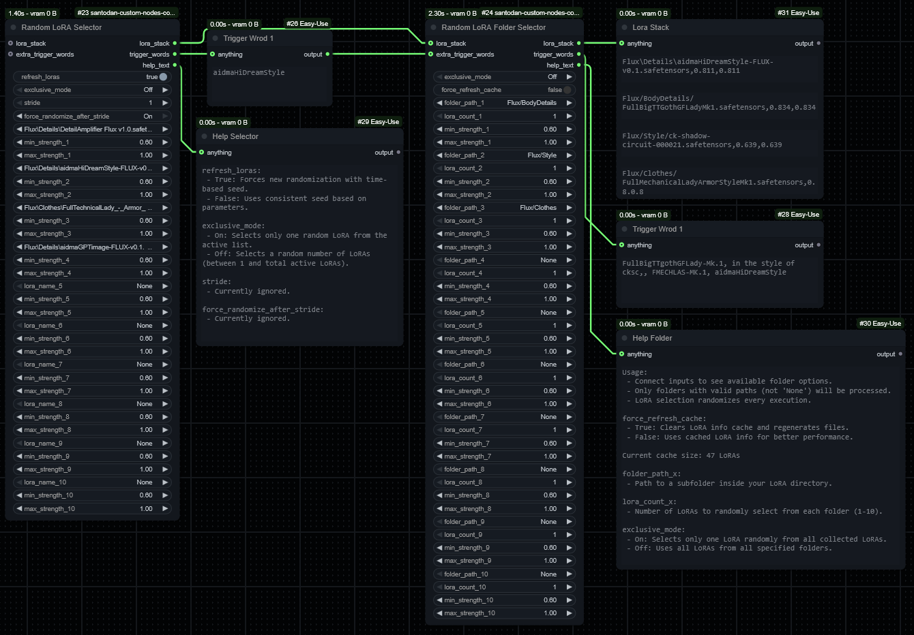

# Santodan Custom Nodes for ComfyUI

This is a standalone ComfyUI custom node for **randomizing LoRAs** with adjustable strength and support for automatic trigger word injection.

> ✅ Compatible with [comfyui_image_metadata_extension](https://github.com/edelvarden/comfyui_image_metadata_extension) by using the `💊 CR Apply LoRA Stack` from [Suzie1 / Comfyroll_CustomNodes](https://github.com/Suzie1/ComfyUI_Comfyroll_CustomNodes)

---

## 🎲 Randomize LoRAs Node

The **Randomize LoRAs** node lets you experiment by randomly selecting LoRAs from a list and assigning randomized strengths. You can enable exclusive selection (just one LoRA) or allow multiple LoRAs to be mixed.

## 🎲 Random LoRA Folder Selector

The **Random LoRA Folder Selector** node lets you experiment by randomly selecting LoRAs from a doler and assigning randomized strengths. You can enable exclusive selection (just one LoRA) or allow multiple LoRAs to be mixed and how many to be selected by folder.

Additionally, if the LoRA includes trigger words (via `lora-info`), these are extracted and returned for use in prompts.

---

### 🔧 Node Inputs

I'll describe only the inputs that are straight forwards here:
- `exclusive_mode`:
  - **On** – choose 1 LoRA only
  - **Off** – choose a random number from the list
- `stride`: Number of runs before re-randomizing (not currently enforced)
- `force_randomize_after_stride`: Avoids repeating same LoRA set (partially supported)
- `refresh_loras`: Dummy input to trigger updates in the UI
- `lora_stack`: (Optional) Input for chaining or merging with existing LoRA stack
- `extra_trigger_words`: (Optional) Additional text to append from previous node
- `force_refresh_cache`: Set to True to clear and regenerate cached LoRA metadata

---

### 📤 Node Outputs

- `LORA_STACK`: A list of `(name, min_strength, max_strength)` tuples
- `Trigger Words`: Comma-separated string of trigger words for selected LoRAs
- `Help Text`: Describes the meaning of each setting for reference

---

### 📤 Cache Behavior

LoRA metadata (like trigger words) is cached to speed up repeat runs.  
Use `force_refresh_cache`: True to clear and reload cache.  
This helps avoid performance issues with large LoRA libraries.

---

### 📥 Installation

#### Option 1: ComfyUI-Manager (recommended)

1. Open ComfyUI
2. Open ComfyUI-Manager
3. Search for `Santodan` or `Randomize LoRAs`
4. Click **Install**

#### Option 2: Manual Install

```bash
cd ComfyUI/custom_nodes
git clone https://github.com/Santodan/ComfyUI_santodan_custom_nodes
```

Then restart ComfyUI.

---

### 🔁 Updating

```bash
cd ComfyUI/custom_nodes/ComfyUI_santodan_custom_nodes
git pull
```

Restart ComfyUI to apply the update.

---

### ❌ Uninstallation

```bash
cd ComfyUI/custom_nodes
rm -rf ComfyUI_santodan_custom_nodes
```

Restart ComfyUI.

---

## 🧠 Credits

- **[Suzie1 / Comfyroll_CustomNodes](https://github.com/Suzie1/ComfyUI_Comfyroll_CustomNodes)**  
  Provided the original randomization logic inspiration.

- **[jitcoder / lora-info](https://github.com/jitcoder/lora-info)**  
  Used for extracting trigger words from LoRA files.

- **ChatGPT**  
  Used to create the whole code as I only have some basic programming knowledge

- **Claude.ai**  
  Used to create the whole code as I only have some basic programming knowledge
  
---

## 📸 Screenshot / Demo



