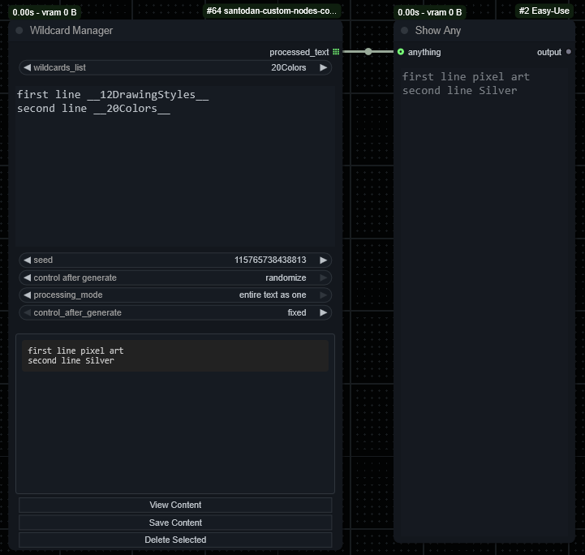
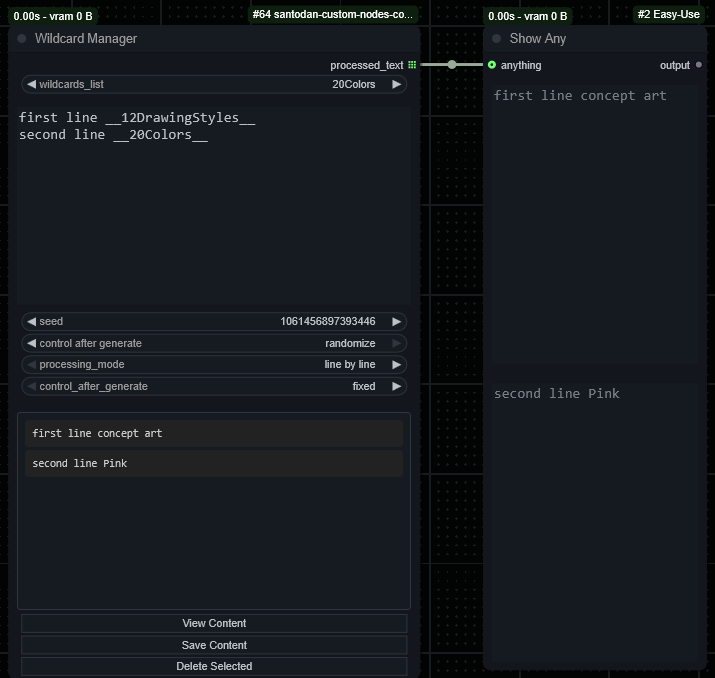
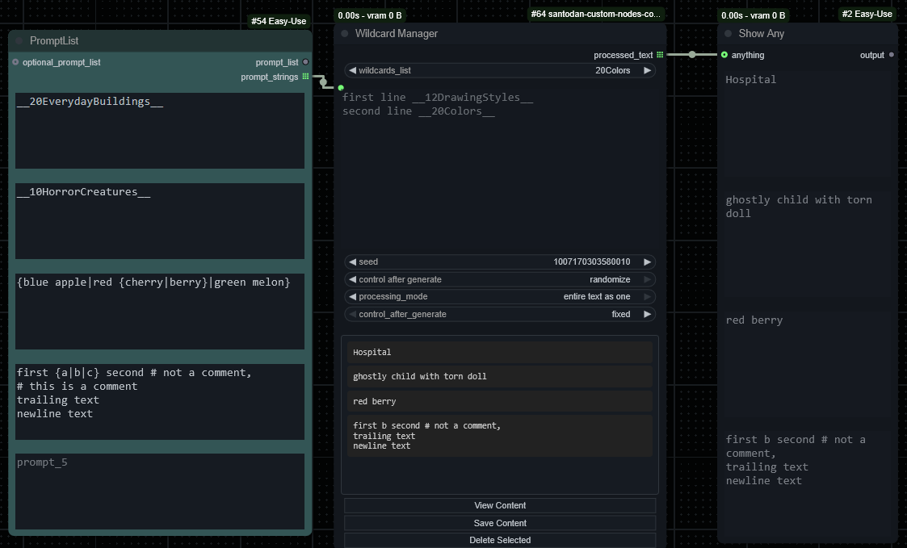
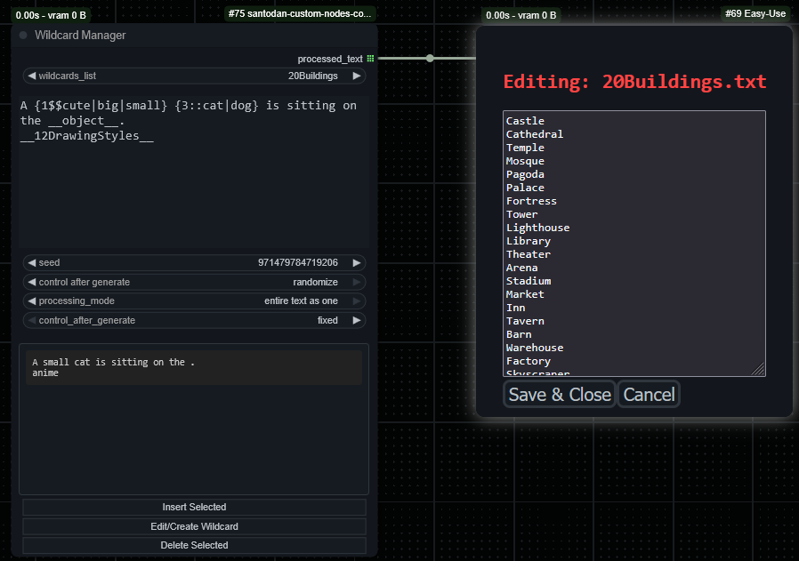
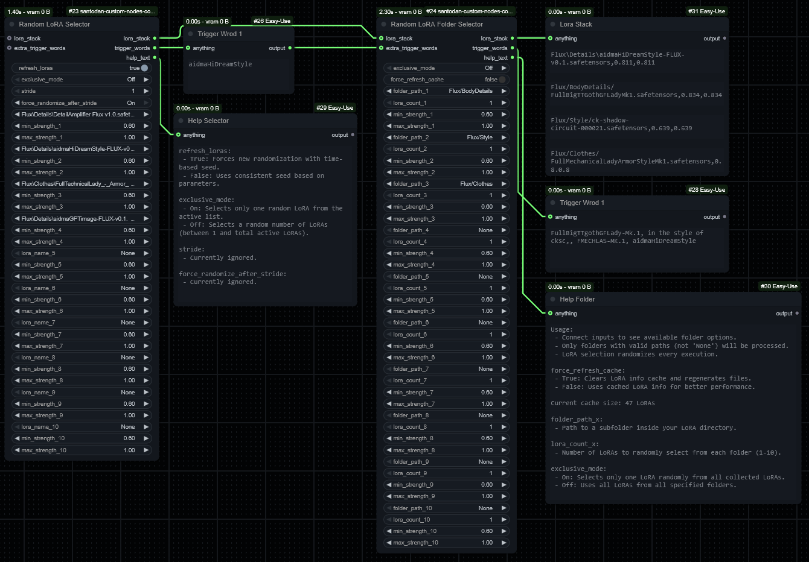

# Santodan Custom Nodes for ComfyUI

This is a group of nodes that I've build to achieve my goals.

---

# 🪄 Wildcard Manager Node

The **Wildcard Manager** is a powerful dynamic prompt and wildcard processor. It allows you to create complex, randomized text prompts using a flexible syntax that supports nesting, weights, multi-selection, and more. It is designed to be compatible with the popular syntax used in the Impact Pack's Wildcard processor, making it easy to adopt existing prompts and wildcards.<br>
It supports both .txt ( default one, not needing the extension) and YAML files ( both .yaml and .yml)

Reading the files from the default ComfyUI folder ( `ComfyUi/Wildcards` )

### ✨ Key Features & Syntax

-   **Dynamic Prompts:** Randomly select one item from a list.
    -   Example: `{blue|red|green}` will randomly become `blue`, `red`, or `green`.
-   **Wildcards:** Randomly select a line from a `.txt` file in your `ComfyUI/wildcards` directory.
    -   Example: `__person__` will pull a random line from `person.txt`.
-   **Nesting:** Combine syntaxes for complex results.
    -   Example: `{a|{b|__c__}}`
-   **Randomize**: Randomize the wildcard independently from the seed.
    -   Example: `__*person__` w ill always pulls a random line from person.txt, regardless of the seed.
    -   Example: `{*red|blue|green}` always pulls a random item from the list, regardless of the seed.
-   **Sequential**: Use `+` to select items in order across different queue runs.
    - Example Wildcard: `__+person__`
    - Example Dynamic: `{+red|blue|green}`
-   **Weighted Choices:** Give certain options a higher chance of being selected.
    -   Example: `{5::red|2::green|blue}` (red is most likely, blue is least).
-   **Multi-Select:** Select multiple items from a list, with a custom separator.
    -   Example: `{1-2$$ and $$cat|dog|bird}` could become `cat`, `dog`, `bird`, `cat and dog`, `cat and bird`, or `dog and bird`.
-   **Quantifiers:** Repeat a wildcard multiple times to create a list for multi-selection.
    -   Example: `{2$$, $$3#__colors__}` expands to select 2 items from `__colors__|__colors__|__colors__`.
-   **Comments:** Lines starting with `#` are ignored, both in the node's text field and within wildcard files.

### 🔧 Wildcard Manager Inputs

-   `wildcards_list`: A dropdown of your available wildcard files. Selecting one inserts its tag (e.g., `__person__`) into the text.
-   `processing_mode`:
    -   **`line by line`**: Treats each line as a separate prompt for batch processing.
    -   **`entire text as one`**: Processes the entire text block as a single prompt, preserving paragraphs.
	
### 🗂️ File Management

The node includes buttons for managing your wildcard files directly from the ComfyUI interface, eliminating the need to manually edit text files.

-   **Insert Selected:** Insertes the selected wildcard to the text.
-   **Edit/Create Wildcard:** Opens the content of the wildcard currently selected in the dropdown in an editor, allowing you to make changes and save/create them.
     - You need to have the `[Create New]` selected in the `wildcards_list` dropdown
-   **Delete Selected:** Asks for confirmation and then permanently deletes the wildcard file selected in the dropdown.

	
## 📸 Screenshot / Demo

- Wildcard - Entire Text As One


- Wildcard - Line By Line


- Wildcard - Comptability with PromptList for a batch processing


- Wildcard - View Content


---

# LoRAs Nodes

## 🎲 Randomize LoRAs Node

The **Randomize LoRAs** node lets you experiment by randomly selecting LoRAs from a list and assigning randomized strengths. You can enable exclusive selection (just one LoRA) or allow multiple LoRAs to be mixed.<br>
There are two nodes for this, the `Random LoRA Selector` and the `Random LoRA Selector to Model Selector`, the difference between them is that one uses the `lora_stack` and the other one applies the loras directly to the model.

## 🎲 Random LoRA Folder Selector

The **Random LoRA Folder Selector** node lets you experiment by randomly selecting LoRAs from a doler and assigning randomized strengths. You can enable exclusive selection (just one LoRA) or allow multiple LoRAs to be mixed and how many to be selected by folder.  <br>
Additionally, if the LoRA includes trigger words (via `lora-info`), these are extracted and returned for use in prompts.<br>
There are two nodes for this, the `Random LoRA Folder Selector` and the `Random LoRA Folder to Model Selector`, the difference between them is that one uses the `lora_stack` and the other one applies the loras directly to the model.

> ✅ Compatible with [comfyui_image_metadata_extension](https://github.com/edelvarden/comfyui_image_metadata_extension) by using the `💊 CR Apply LoRA Stack` from [Suzie1 / Comfyroll_CustomNodes](https://github.com/Suzie1/ComfyUI_Comfyroll_CustomNodes)

> ✅ Compatible with [comfyui_image_metadata_extension](https://github.com/edelvarden/comfyui_image_metadata_extension) by using the [`LoRA Metadata Hub`](https://github.com/Santodan/santodan-custom-nodes-comfyui/?tab=readme-ov-file#lora-metadata-hub)

## 🎲🚫 Excluded Loras

The **Excluded Loras** node lets you select 5 lroas to be excluded in the **Random LoRA Folder Selecto**, this way you don't need to worry about the select getting an unwanted lora from the folder

## 🎲⛏️ Extract And Apply LoRAs

The **Extract And Apply LoRAs** node lets you extract the LoRAs that were saved using the [comfyui_image_metadata_extension](https://github.com/edelvarden/comfyui_image_metadata_extension) node and apply them to a workflow.<br>
This was created so I could try to generate better enhancement workflow but with the same loras and weight as the initial one.<br>
I would recommend use the [SDBatchLoader](https://github.com/receyuki/comfyui-prompt-reader-node) to load multiple images at the same time and connecting the output to the path field in my node<br>

## 🎲📦 LoRA Cache Preloader

This is a node to have the information for the loras preloaded into the `db.json`  <br>
You can select the folder that you want to run it.<br>
This way you don't need to wait for the information to be gathered when running the other two nodes<br>

---

### 🔧 Node Inputs

I'll describe only the inputs that aren't straight forwards here:
- `refresh_loras`: To force a refresh of LoRAs everytime
- `exclusive_mode`:
  - **On** – choose 1 LoRA only
  - **Off** – choose a random number from the list
- `stride`: Number of runs before re-randomizing (not currently enforced)
- `lora_count`: the number of LoRAs to be extracted from the list ( if 0 it will be a random value / `exclusive_mode` will overcome this is set to **On** )
- `lora_stack`: (Optional) Input for chaining or merging with existing LoRA stack
- `extra_trigger_words`: (Optional) Additional text to append from previous node
- `force_refresh_cache`: Set to True to clear and regenerate cached LoRA metadata

---

### 📤 Node Outputs

- `LORA_STACK`: A list of `(name, min_strength, max_strength)` tuples
- `Trigger Words`: Comma-separated string of trigger words for selected LoRAs
- `Help Text`: Describes the meaning of each setting for reference

---

### 📤 Cache Behavior

LoRA metadata (like trigger words) is cached to speed up repeat runs.  
Use `force_refresh_cache`: True to clear and reload cache.  
This helps avoid performance issues with large LoRA libraries.

---

## 📸 Screenshot / Demo



---

## 🔄 Other Nodes:
### PromptList w/ Template
Based on the PromptList from Impact, but this one will be able to save, edit and delete templates

### SaveWorkflowAndShutdown
A simple node to shutdown the PC at the end of the workflow if there are no more jobs in the queue.<br>
There is a delay input, if you want to interrupt, cancel comfyui's process

### Split Batch With Prefix
A node to to transform a batch of images into a list.<br>
It will also ask for a prefix and an index, so it will generate a prompt list.<br>
The purpose is to save each image from a batch with a corresponding index.<br>
Example, you have a 5 images batch, you run the node and will output the images as a list and a prompt string of the index+Prefix ( example 0-SDXL_, 1-SDXL_, 2-SDXL_, 3-SDXL_, 4-SDXL_)

### Model Assembler
A Model to combine the model checkpoint, unet loader, clip loader and vae loader.<br>
Created so I don't have to change connections when testing full models and fp8 versions

### LoRA Metadata Hub
Node used to add the metadata from the loras to the image metadata together with the [comfyui_image_metadata_extension](https://github.com/edelvarden/comfyui_image_metadata_extension) node.<br>
You may need to add/edit the `modules/defs/ext/SantodanNodes.py` file to add the following code - [SantodanNodes.py](https://github.com/Santodan/comfyui_image_metadata_extension/blob/9fce1d69d72d3c75c1fc46c1b4f2ab50f2c46016/modules/defs/ext/SantodanNodes.py) - since the node OP hasn't updated the node for a couple of months, or just my whole node

---

### 📥 Installation

#### Option 1: ComfyUI-Manager (recommended)

1. Open ComfyUI
2. Open ComfyUI-Manager
3. Search for `Santodan` or `Randomize LoRAs`
4. Click **Install**

#### Option 2: Manual Install

```bash
cd ComfyUI/custom_nodes
git clone https://github.com/Santodan/ComfyUI_santodan_custom_nodes
```

Then restart ComfyUI.

---

### 🔁 Updating

```bash
cd ComfyUI/custom_nodes/ComfyUI_santodan_custom_nodes
git pull
```

Restart ComfyUI to apply the update.

---

### ❌ Uninstallation

```bash
cd ComfyUI/custom_nodes
rm -rf ComfyUI_santodan_custom_nodes
```

Restart ComfyUI.

---

## 🧠 Credits

- **[Suzie1 / Comfyroll_CustomNodes](https://github.com/Suzie1/ComfyUI_Comfyroll_CustomNodes)**  
  Provided the original randomization logic inspiration.

- **[jitcoder / lora-info](https://github.com/jitcoder/lora-info)**  
  Used for extracting trigger words from LoRA files.

- **ChatGPT**  
  Used to create the whole code as I only have some basic programming knowledge

- **Claude.ai**  
  Used to create the whole code as I only have some basic programming knowledge

- **Gemini (Google AI)**  
  Used to create the whole code as I only have some basic programming knowledge
