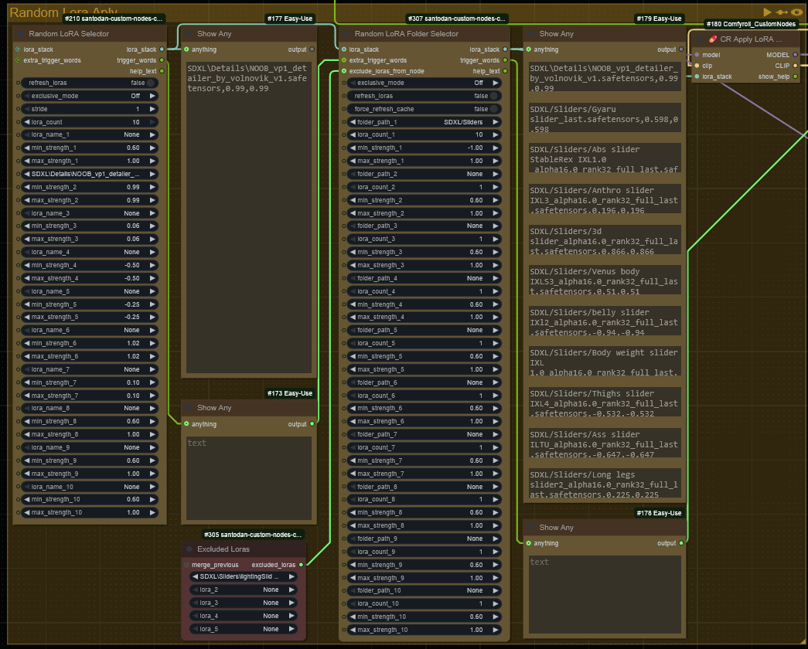

# Santodan Custom Nodes for ComfyUI

This is a standalone ComfyUI custom node for **randomizing LoRAs** with adjustable strength and support for automatic trigger word injection.

> ✅ Compatible with [comfyui_image_metadata_extension](https://github.com/edelvarden/comfyui_image_metadata_extension) by using the `💊 CR Apply LoRA Stack` from [Suzie1 / Comfyroll_CustomNodes](https://github.com/Suzie1/ComfyUI_Comfyroll_CustomNodes)

---

## 🎲 Randomize LoRAs Node

The **Randomize LoRAs** node lets you experiment by randomly selecting LoRAs from a list and assigning randomized strengths. You can enable exclusive selection (just one LoRA) or allow multiple LoRAs to be mixed.

## 🎲 Random LoRA Folder Selector

The **Random LoRA Folder Selector** node lets you experiment by randomly selecting LoRAs from a doler and assigning randomized strengths. You can enable exclusive selection (just one LoRA) or allow multiple LoRAs to be mixed and how many to be selected by folder.  
Additionally, if the LoRA includes trigger words (via `lora-info`), these are extracted and returned for use in prompts.

## 🎲🚫 Excluded Loras

The **Excluded Loras** node lets you select 5 lroas to be excluded in the **Random LoRA Folder Selecto**, this way you don't need to worry about the select getting an unwanted lora from the folder

## 🎲⛏️ Extract And Apply LoRAs

The **Extract And Apply LoRAs** node lets you extract the LoRAs that were saved using the [comfyui_image_metadata_extension](https://github.com/edelvarden/comfyui_image_metadata_extension) node and apply them to a workflow.
This was created so I could try to generate better enhancement workflow but with the same loras and weight as the initial one.
I would recommend use the [SDBatchLoader](https://github.com/receyuki/comfyui-prompt-reader-node) to load multiple images at the same time and connecting the output to the path field in my node

## 🎲📦 LoRA Cache Preloader

This is a node to have the information for the loras preloaded into the `db.json`  
You can select the folder that you want to run it.  
This way you don't need to wait for the information to be gathered when running the other two nodes

---

### 🔧 Node Inputs

I'll describe only the inputs that aren't straight forwards here:
- `refresh_loras`: To force a refresh of LoRAs everytime
- `exclusive_mode`:
  - **On** – choose 1 LoRA only
  - **Off** – choose a random number from the list
- `stride`: Number of runs before re-randomizing (not currently enforced)
- `lora_count`: the number of LoRAs to be extracted from the list ( if 0 it will be a random value / `exclusive_mode` will overcome this is set to **On** )
- `lora_stack`: (Optional) Input for chaining or merging with existing LoRA stack
- `extra_trigger_words`: (Optional) Additional text to append from previous node
- `force_refresh_cache`: Set to True to clear and regenerate cached LoRA metadata

---

### 📤 Node Outputs

- `LORA_STACK`: A list of `(name, min_strength, max_strength)` tuples
- `Trigger Words`: Comma-separated string of trigger words for selected LoRAs
- `Help Text`: Describes the meaning of each setting for reference

---

### 📤 Cache Behavior

LoRA metadata (like trigger words) is cached to speed up repeat runs.  
Use `force_refresh_cache`: True to clear and reload cache.  
This helps avoid performance issues with large LoRA libraries.

---

## 📸 Screenshot / Demo



---

### 📥 Installation

#### Option 1: ComfyUI-Manager (recommended)

1. Open ComfyUI
2. Open ComfyUI-Manager
3. Search for `Santodan` or `Randomize LoRAs`
4. Click **Install**

#### Option 2: Manual Install

```bash
cd ComfyUI/custom_nodes
git clone https://github.com/Santodan/ComfyUI_santodan_custom_nodes
```

Then restart ComfyUI.

---

### 🔁 Updating

```bash
cd ComfyUI/custom_nodes/ComfyUI_santodan_custom_nodes
git pull
```

Restart ComfyUI to apply the update.

---

### ❌ Uninstallation

```bash
cd ComfyUI/custom_nodes
rm -rf ComfyUI_santodan_custom_nodes
```

Restart ComfyUI.

---

## 🧠 Credits

- **[Suzie1 / Comfyroll_CustomNodes](https://github.com/Suzie1/ComfyUI_Comfyroll_CustomNodes)**  
  Provided the original randomization logic inspiration.

- **[jitcoder / lora-info](https://github.com/jitcoder/lora-info)**  
  Used for extracting trigger words from LoRA files.

- **ChatGPT**  
  Used to create the whole code as I only have some basic programming knowledge

- **Claude.ai**  
  Used to create the whole code as I only have some basic programming knowledge
